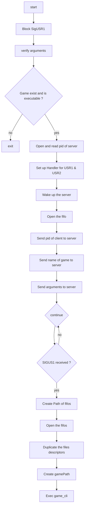

```mermaid
flowchart TB
    A[start] --> B[Block SigUSR1]
    B --> C[verify arguments]
    C --> D{Game exist and is executable ?}
    D -->|no| E[exit]
    D -->|yes| F[Open and read pid of server]
    F --> G[Set up Handler for USR1 & USR2]
    G --> H[Wake up the server]
    H --> I[Open the fifo]
    I --> J[Send pid of client to server]
    J --> K[Send name of game to server]
    K --> L[Send arguments to server]
    L --> M{continue}
    M --> N{SIGUS1 received ?}
    N -->|no| M
    N -->|yes| O[Create Path of fifos]
    O --> P[Open the fifos]
    P --> Q[Duplicate the files descriptors]
    Q --> R[Create gamePath]
    R --> S[Exec game_cli]


```