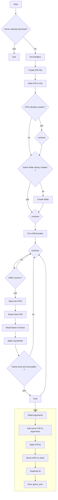

```mermaid
flowchart TB
    A[Start] --> B{Server already launched?}
    B -->|yes| C[Exit]
    B -->|no| D[Put handlers]
    D --> E[Create PID File]
    E --> F[Write PID in File]
    F --> G{FIFO already created ?}
    G -->|yes| H{continue}
    G -->|no| I[Create PID File]
    H --> I{Game folder alreay created ?}
    I -->|no| J[Create folder]
    I -->|yes| K{continue}
    J --> K{continue}
    K --> L[Put USR1handler]
    L --> M{continue}
    M --> N{USR1 receive ?}
    N -->|yes| O[Open the FIFO]
    N -->|no| M
    O --> P[Read Client PID]
    P --> Q[Read Name of Game]
    Q --> R[Make GamePath]
    R --> S{Game exist and executable ?}
    S -->|no| M
    S -->|yes| T[Fork]
    T --> U[Read arguments]
    T --> M
    subgraph child
       U --> V[Add server PID to arguments]
       V --> W[Make FIFOs]
       W --> X[Send USR1 to client]
       X --> Y[Duplicate fd]
       Y --> Z[Exec game_serv]
    end
```