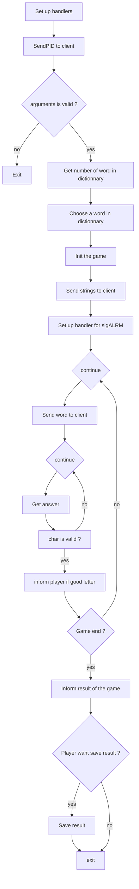

```mermaid
flowchart TB
    A[Set up handlers] --> B[SendPID to client]
    B --> C{arguments is valid ?}
    C -->|no| D[Exit]
    C -->|yes| E[Get number of word in dictionnary]
    E --> F[Choose a word in dictionnary]
    F --> G[Init the game]
    G --> H[Send strings to client]
    H --> I[Set up handler for sigALRM]
    I --> J{continue}
    J --> K[Send word to client]
    K --> L{continue}
    L --> M[Get answer]
    M --> N[char is valid ?]
    N -->|no| L
    N -->|yes| O[inform player if good letter]
    O --> P{Game end ?}
    P -->|no| J
    P -->|yes| Q[Inform result of the game]
    Q --> R{Player want save result ?}
    R -->|yes| S[Save result]
    S --> T[exit]
    R-->|no| T

```