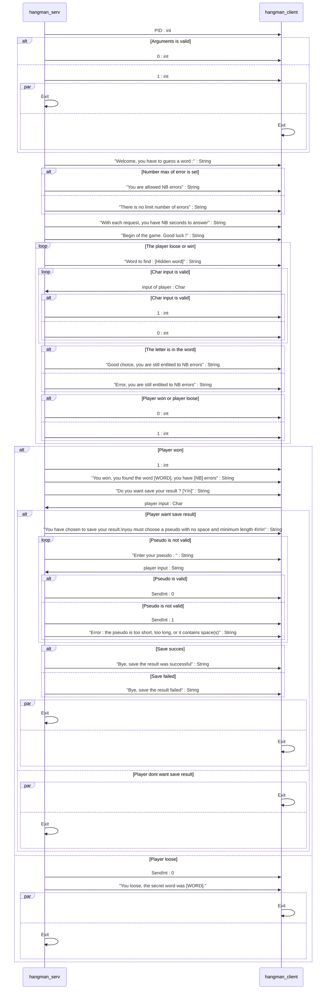

```mermaid
sequenceDiagram
    participant S as hangman_serv
    participant C as hangman_client
    S ->> C : PID : int
    alt Arguments is valid
        S ->> C : 0 : int
    else
        S ->> C : 1 : int
        par
            S ->> S : Exit
        and
            C ->> C : Exit
        end
    end
    S ->> C : "Welcome, you have to guess a word :" : String 
    alt Number max of error is set
        S ->> C : "You are allowed NB errors" : String
    else
        S ->> C : "There is no limit number of errors" : String
    end
    S ->> C : "With each request, you have NB seconds to answer" : String
    S ->> C : "Begin of the game. Good luck !" : String
    loop The player loose or win
        S ->> C : "Word to find : [Hidden word]" : String
        loop Char input is valid
            C ->> S : input of player : Char
            alt Char input is valid
                S ->> C : 1 : int
            else
                S ->> C : 0 : int
            end
        end
        alt The letter is in the word
            S ->> C : "Good choice, you are still entlited to NB errors" : String
        else
            S ->> C : "Error, you are still entlited to NB errors" : String
        end
        alt Player won or player loose
            S ->> C : 0 : int
            
        else
            S ->> C : 1 : int
        end
    end
    alt Player won
        S ->> C : 1 : int
        S ->> C : "You won, you found the word [WORD], you have [NB] errors" : String
        S ->> C : "Do you want save your result ? [Y/n]" : String
        C ->> S : player input : Char
        alt Player want save result
            S ->> C : "You have chosen to save your result,\nyou must choose a pseudo with no space and minimum length 4\n\n" : String
            loop Pseudo is not valid
                S ->> C : "Enter your pseudo : " : String
                C ->> S : player input : String
                alt Pseudo is valid
                    S ->> C : SendInt : 0
                else Pseudo is not valid
                    S ->> C : SendInt : 1
                    S ->> C : "Error : the pseudo is too short, too long, or it contains space(s)" : String
                end
            end
            alt Save succes
                S ->> C : "Bye, save the result was successful" : String
            else Save failed
                S ->> C : "Bye, save the result failed" : String
            end
            par
                S ->> S : Exit
            and
                C ->> C : Exit
            end
        else Player dont want save result
            par
                C ->> C : Exit
            and
                S ->> S : Exit
            end
        end
    else Player loose
        S ->> C : SendInt : 0
        S ->> C : "You loose, the secret word was [WORD]."
        par
            C ->> C : Exit
        and
            S ->> S : Exit
        end
    end
```

